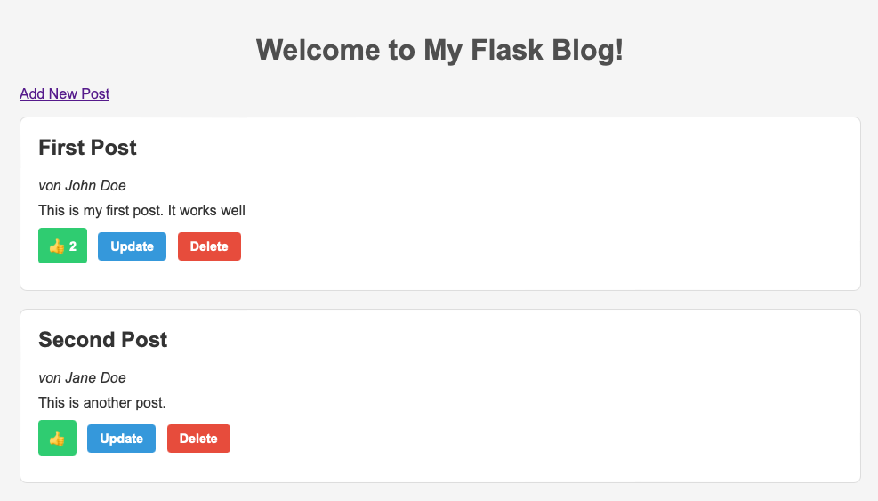

# MasterBlog



## Project Overview 

MasterBlog is a simple Flask-based blogging application that allows users to create, read, update, delete, and like blog posts. Blog data is stored in a JSON file (`posts.json`), and the application supports basic CRUD operations via intuitive routes and modern UI buttons.

## Features

* **Add Posts**: Users can add new posts with author, title, and content.
* **Update Posts**: Existing posts can be edited via a pre-filled form.
* **Delete Posts**: Posts can be removed with a confirmation prompt.
* **Like Posts**: Users can increment a post’s like count with a single click.

## To-Do

* **User Management**: Implement authorization so that admin tasks (update, delete) are restricted to authorized users.

## Installation

1. Clone the repository:

   ```bash
   git clone https://github.com/your-username/masterblog.git
   cd masterblog
   ```
2. (Optional) Create a virtual environment:

   ```bash
   python3 -m venv venv
   source venv/bin/activate
   ```
3. Install dependencies:

   ```bash
   pip install flask
   ```

## Usage

1. Ensure `posts.json` exists in the project root with initial sample posts.
2. Run the application:

   ```bash
   python app.py
   ```
3. Open your browser at `http://localhost:5000`.

## License

This project is licensed under the MIT License.
